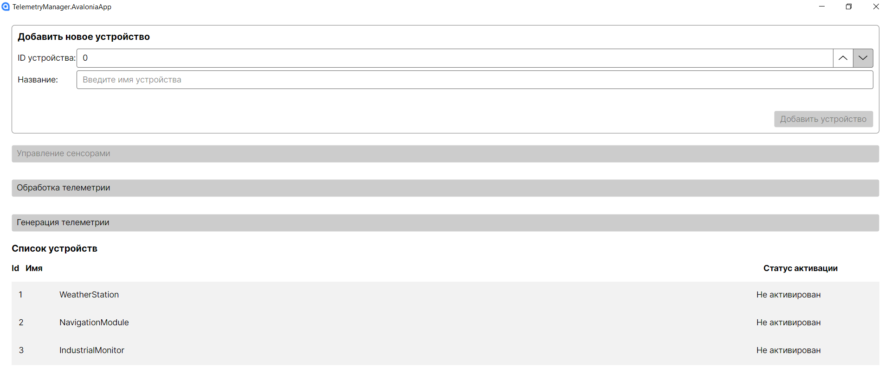
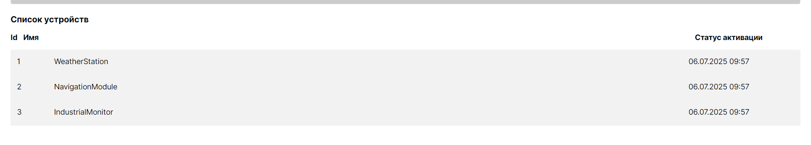
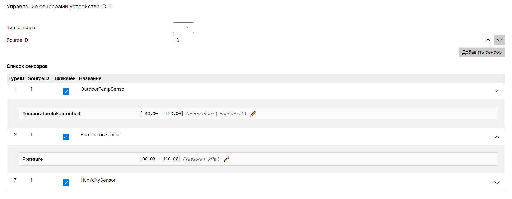
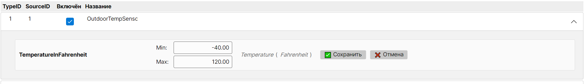
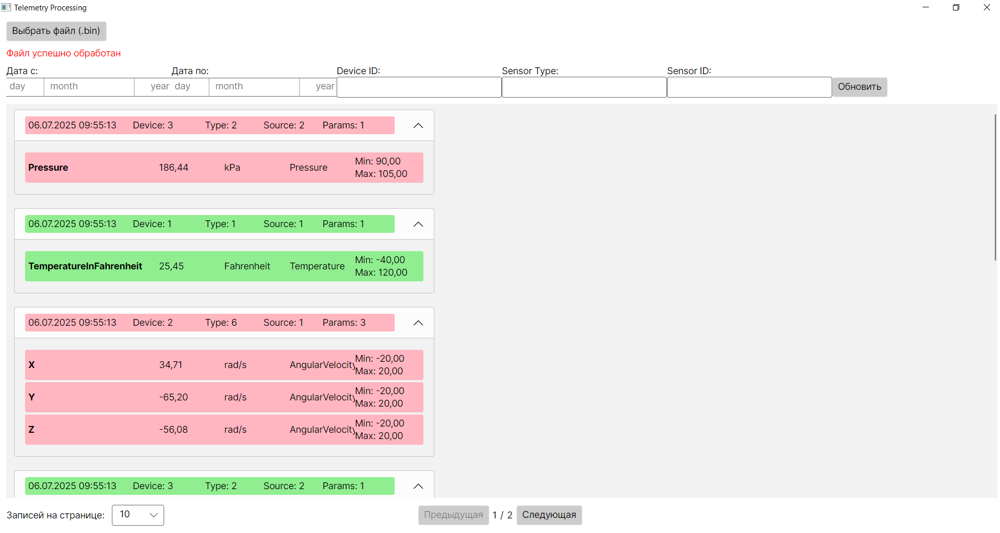
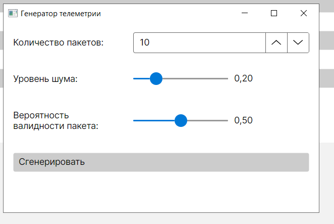

## Главное окно
В главном окне расположена форма для добавления нового устройства. И отображается спсиок доступных устройств


### Активация устройств
Рнализована логика активации устройств. При добавлении нового устройства оно считается не активированным. При получении первого пакета от этого устройства определяется время активации (высчитывается как дата и время получения пакета минус количество милисекунд в поле Time пакета).



## Окно управления датчиками устройства
Реализована возможность активации и выключения датчика для конкретного устройства. При обработке новых пакетов телеметрии учитываются только пакеты от активированных датчиков

Вес активации и выключения датчиков фиксируются. Это позволяет отследить хронологию. 



Благодаря тому что для каждого параметра в заданных типах поля контент хранится единица измерения (unit) и величина (quantity) можно легко интегрировать этот проект для использования вместе с библиотекой Units net https://github.com/angularsen/UnitsNet, которая позволяет очень гибко проводить операции с величинами и добавлять свои. Например это будет полезно для конвертации величин и сравнения данных с разных датчиков измеряющих одну величину.


### Изменение интервала параметра 
Реализована возможность изменять значения интервала для любого параметра любого датчика. Хронология изменений значений фиксируется.




## Окно просмотра обработанных пакетов с телеметрией
Реализована возможность импорта бинарных файлов с телеметрией.

При отображении списка пакетов с полученной телеметрией параметры , которые находятся в рамках диапазона отображаются зелёным, а параметры выходящие за диапазон красным. Если хотя бы один параметр выходит за диапазон то шапка пакета тоже отображается красной. Для списка пакетов реализована пагинация.



При обработке новых пакетов телеметрии информация о всех пакетах с некорректными данными логируется. В парсер пакетов внедрен стандартный интерфейс ILogger. Для сохранения логов в файл используется библиотека Serilog.

## Окно генерации пакетов с телеметрией
Реализован генератор пакетов телеметрии. Он позволяет настроить количество пакетов, вероятность генерации испорченных пакетов и вероятность генерации пакетов, в которых значения параметров выходят за границы.
Генератор берет данные из репозитория устройств и репозитория content definition для генерации пакетов с данными существующих устройств, датчиков и форматов поля content.



## Подробности реализации

Все view models для Avalonia  находятся в отдельном проекте. Благодаря этому view model никак не зависит от view.
Сервис выбора существующих файлов и выбор папки при создании нового файла реализован в проекте Avalonia,  но view model  зависит только от его интерфейса.

В view models применяется ReactiveUI.Fody для сокращения кода.

Все  view максимально тонкие, содержат только  axaml  и логику реагирования на срабатывание Interaction и команд, которые связаны с открытием новых окон, пеердачей в них параметров и получение результата при закрытии дочернего окна.

### Использование DDD
При реализации проекта я тренировался в использовании domain driven design.

Device  реализован как агрегата. Sensor  и parameter как entity. Все они содержат бизнес логику. В доменной модели используются value objects  для имён и интервалов. В репозитории сохраняется только корен агрегата device.
Классы агрегата и entity можно посмтреть в этой папке [Папка Profiles](TelemetryManager.Core/Data/Profiles)

Классы value objects можно посмотреть  в этой папке [Папка value objects](TelemetryManager.Core/Data/ValueObjects/)

### Гибкое добавление новых форматов поля content
Реализована гибкая возможность добавления новых типов поля content засчёт того, что использовать интерфейс 
```csharp
public interface IDataTypeHandler
{
    int GetSize();
    object ParseValue(ReadOnlySpan<byte> data);
    double ConvertToDouble(object value);
}
```

Пример реализации:
```csharp
public class IntHandler : IDataTypeHandler
{
    public int GetSize() => sizeof(int);

    public object ParseValue(ReadOnlySpan<byte> data)
        => BinaryPrimitives.ReadInt32BigEndian(data);

    public double ConvertToDouble(object value)
        => (int)value;
}
```